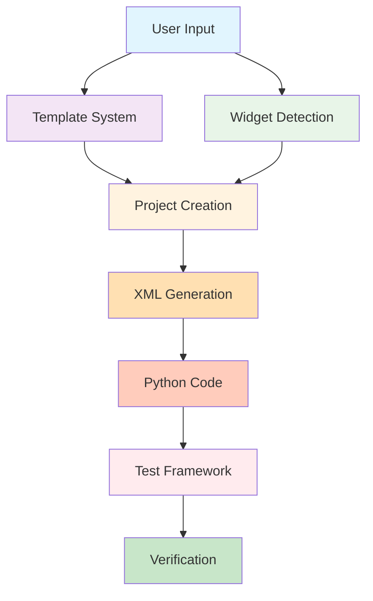

# PygubuAI Architecture

## System Overview

PygubuAI is a layered architecture that bridges natural language input with Tkinter UI generation through Pygubu.



## Core Components

### 1. Widget Detection Engine (`pygubuai_widgets.py`)

**Purpose**: Converts natural language descriptions into widget specifications.

**Features**:
- Pattern-based keyword matching
- Context-aware detection (login, form, settings)
- 15+ widget types supported
- Configurable widget properties

**Flow**:
```
"login form" → Context Pattern → [label, entry, label, entry, button]
```

### 2. Template System (`pygubuai_templates.py`)

**Purpose**: Provides pre-built UI patterns for common use cases.

**Features**:
- 5 professional templates
- Auto-generated callbacks
- Configurable layouts
- XML generation from templates

**Structure**:
```python
Template → Widget List → XML → Python Code
```

### 3. Project Creation (`pygubu-create`, `pygubu-template`)

**Purpose**: Orchestrates project generation from input to working app.

**Features**:
- Directory structure creation
- XML UI file generation
- Python application code
- Callback stub generation

### 4. Testing Framework (`tests/`, `run_tests.py`)

**Purpose**: Ensures reliability and catches regressions.

**Features**:
- 23 automated tests
- Modular test structure
- Fast execution (<0.01s)
- Coverage tracking

## Data Flow

### Natural Language → UI

```
1. User Input: "login form with username and password"
2. Widget Detection: Analyze keywords and context
3. Widget List: [label, entry, label, entry, button]
4. XML Generation: Create Pygubu UI XML
5. Code Generation: Create Python application
6. Result: Working Tkinter app
```

### Template → UI

```
1. User Input: "pygubu-template myapp login"
2. Template Lookup: Find "login" template
3. Widget Configuration: Load pre-defined widgets
4. XML Generation: Create Pygubu UI XML
5. Code Generation: Create Python application with callbacks
6. Result: Professional login form
```

## Component Interactions

### Widget Detection + Templates

Templates can use widget detection for dynamic content:
```python
# Template defines structure
template = {"widgets": [...]}

# Widget detection fills in details
widgets = detect_widgets(user_description)
```

### Project Creation + Registry

Projects are tracked globally:
```python
# Create project
create_project(name, description)

# Auto-register
registry.add_project(name, path)

# Access from any AI chat
registry.get_active_project()
```

## Extension Points

### Adding New Widgets

```python
# In pygubuai_widgets.py
WIDGET_CONFIGS["newwidget"] = {
    "keywords": ["new", "widget"],
    "class": "ttk.NewWidget",
    "properties": {"option": "value"},
}
```

### Adding New Templates

```python
# In pygubuai_templates.py
TEMPLATES["newtemplate"] = {
    "description": "...",
    "widgets": [...],
    "callbacks": [...],
}
```

### Adding New Tests

```python
# In tests/test_newfeature.py
class TestNewFeature(unittest.TestCase):
    def test_feature(self):
        result = new_feature()
        self.assertEqual(result, expected)
```

## Quality Assurance

### Testing Strategy

1. **Unit Tests**: Individual component testing
2. **Integration Tests**: Component interaction testing (future)
3. **Coverage**: Track code coverage metrics
4. **CI/CD**: Automated testing on commits (future)

### Code Quality

- Type hints for clarity
- Docstrings for documentation
- Consistent naming conventions
- Modular design for maintainability

## Performance Considerations

### Current Performance

- Widget detection: <0.001s per description
- Template generation: <0.01s per template
- Test suite: <0.01s for 23 tests
- Project creation: <0.1s per project

### Optimization Opportunities

- Cache compiled regex patterns
- Lazy load templates
- Parallel test execution
- Incremental XML generation

## Security Considerations

- No external network calls
- Local file system only
- User input sanitization
- Safe XML generation

## Future Architecture

### Planned Enhancements

1. **Plugin System**: Allow third-party extensions
2. **Visual Editor**: GUI for template creation
3. **LLM Integration**: Direct AI model integration
4. **Cloud Sync**: Share templates and projects

### Scalability

- Modular design supports growth
- Clear separation of concerns
- Extensible configuration system
- Backward compatibility maintained

## Development Workflow

### Adding a Feature

1. Design component interface
2. Implement core functionality
3. Add unit tests
4. Update documentation
5. Run coverage report
6. Submit PR

### Testing Workflow

```bash
# Run tests
python3 run_tests.py

# Check coverage
./run_coverage.sh

# View coverage report
open htmlcov/index.html
```

## Conclusion

PygubuAI's architecture is designed for:
- **Simplicity**: Easy to understand and extend
- **Reliability**: Comprehensive testing
- **Flexibility**: Multiple input methods
- **Performance**: Fast execution
- **Maintainability**: Clean, modular code

The layered approach allows each component to evolve independently while maintaining system integrity.
